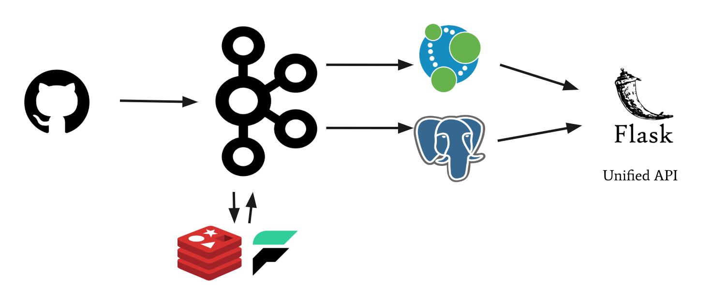

# GitHub Events Monitor

Using the [GH Archive](https://www.gharchive.org/) dataset of events on the public GitHub timeline, the goal of this project is to build real-time ingestion and processing application with Kafka to monitor topics, contributions, repositories, and collaborations of interest.

## Ingestion
The [GH Archive](https://www.gharchive.org/) is available for download via an API, however to mitigate the risk of the streaming directly from the API during my Kafka ingestion, I'm also storing all of this data in an S3 bucket. This process is done with `api_to_s3.py` which takes dates as command line date arguments. This is so that it can be run across different subsets of dates from the shell on multiple EC2 instances in parallel to speed up ingestion. The only requirements are that the `awscli` is configured with your credentials on each instance and python3 is installed with the necessary packages (e.g. `boto3`). Additionally, a file `logs/gh-events.log` in your directory and an S3 bucket already built and named `git-events` will allow the script to be run without modifications.

## Kafka Cluster

- Set up w/ Peg **EXPAND ON THIS**
- upgrade python version to 3.6 (for faust, neo4j, redis dependicies)
- install faust, neo4j, redis, postgresql python3 drivers on each

### Creating Topics
`kafka-topics.sh --create --zookeeper localhost:2181 --replication-factor <rep-factor> --partitions <num-partitions> --topic <topic-name>`
### Confirming creation on other brokers
`kafka-topics.sh --describe --zookeeper localhost:2181 --topic <topic-name>`
### Producing Custom Message from Node
`kafka-console-producer.sh --broker-list localhost:9092 --topic <topic-name>`
- Enter Message in console
### Viewing Consumed Messages from Node
`kafka-console-consumer.sh --zookeeper localhost:2181 --from-beginning --topic <topic-name>`
- Note optional `--from-beginning` tag

### Producers + Kafka-Python
`pip3 install kafka-python`

### Producing from API to git-events topic
`./producer.py <ip-address>:9092 <start-year> <start-month> <start-day> <end-year> <end-month> <end-day>`

### Streaming from Kafka Topic (git-events) to Kafka Topics (pr-events, collab, pr-closed-ids)
- Create new pr-events topic (as above)
- Install `faust`, a pure Python stream processing library for Kafka (`pip3 install faust`)
- Create Streamer (`streamers.py`)
  - Create a faust app, acknowledge the previously created topics
  - Create an agent to consume from the git-events topic, filter for pr-events, and then produce to the pr-events topic
- Run `faust -A streamers worker -l info` to run streamer

### Consuming collab Topic to Neo4j
- `./consumers collab`

### Testing Kafka Cluster
- Create a 'test' topic in Kafka Cluster
- `testing/test_pipeline.py` produces to this topic with `EventsProducer` by reading from `test.json`
- This topic can be monitored as outlined above.

### Neo4j
- Start a new instance that will host the collaboration network in a Neo4j database.

### Redis + PostgreSQL
- Redis can run as a cache on the kafka-cluster, but PostgreSQL, which will be used to store PR metrics, repository, and user information, will require a new instance.

## Front-End API
The API and front-end are built with Flask, with some help from Javascript Ajax calls. The front-end can be run from an EC2 instance that has open connections to to the Neo4j and Postgres instances.

## Final Pipeline

